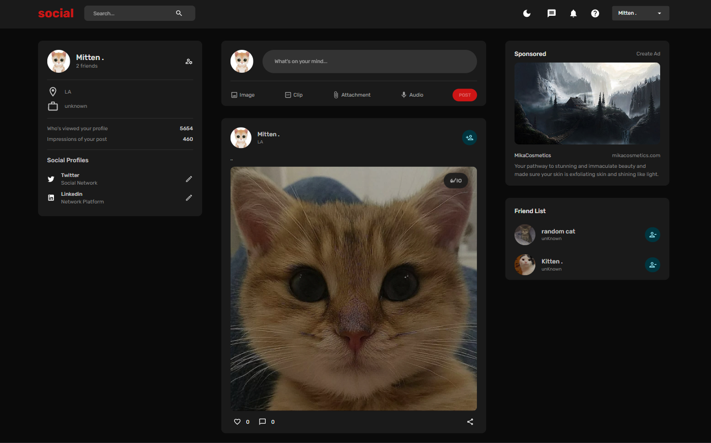

# social media website using React 18! (MERN stack)

Build a social media website using React 18! where you will be able to sign in in and sign out using email and password Authentication, create and like post, also you can add friends.

## Welcome! 
Thanks for checking out this Application.

## Overview

### Links
- Live Site URL => Not Deployed yet

## My process

### Built with

- React Js
- Node js
- Express
- mongooDB
- redux toolkit
- react router dom
- material ui
- JavaScript
- JSX

## Author

- Linkedin - [@jaafar youssef](https://www.linkedin.com/in/jaafar-youssef-923100249/)

jaafar youssef
